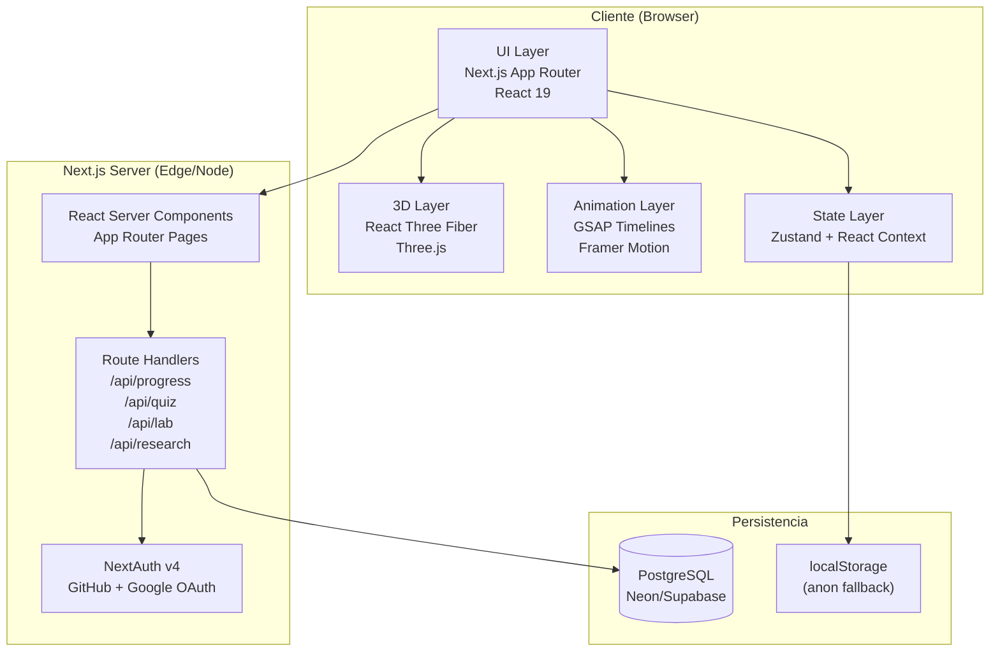

# Documento de Diseño Técnico

## LBioSim: Plataforma Interactiva de Biología Molecular

**Versión:** 1.0  
**Proyecto:** LBioSim v2  
**Stack:** Next.js 16 (App Router) · React Three Fiber · GSAP · Framer Motion · Prisma · PostgreSQL · Tailwind v4 · NextAuth

---

## Índice

1. [Resumen General](#1-resumen-general)
2. [Arquitectura del Sistema](#2-arquitectura-del-sistema)
3. [Estructura de Rutas y Jerarquía de Componentes](#3-estructura-de-rutas-y-jerarquía-de-componentes)
4. [Modelos de Datos (Prisma)](#4-modelos-de-datos-prisma)
5. [Rutas API (App Router)](#5-rutas-api-app-router)
6. [Algoritmos Centrales](#6-algoritmos-centrales)
7. [Arquitectura de Animaciones](#7-arquitectura-de-animaciones)
8. [Gestión de Estado](#8-gestión-de-estado)
9. [Propiedades de Corrección](#9-propiedades-de-corrección)
10. [Estrategia de Fallback WebGL](#10-estrategia-de-fallback-webgl)
11. [Manejo de Errores](#11-manejo-de-errores)
12. [Estrategia de Pruebas](#12-estrategia-de-pruebas)

---

## Overview

## 1. Resumen General

LBioSim v2 transforma el simulador de Máquinas de Turing en una plataforma educativa completa de Biología Molecular. La arquitectura reutiliza la infraestructura existente (NextAuth, Prisma/PostgreSQL, DNAScene con React Three Fiber, tema dark zinc/emerald) y la extiende con 15 módulos de aprendizaje interactivos, animaciones 3D de los procesos del dogma molecular, laboratorio virtual, evaluación con quiz, y un sistema de progreso persistente.

**Principios de diseño:**
- Reutilización máxima del código existente (DNAScene, store, types, constants)
- Lazy loading de todos los módulos 3D para cumplir el target de FCP < 3 s
- Separación estricta entre lógica de algoritmos puros (testeables con PBT) y capa de presentación
- Contextos React independientes por módulo + contexto molecular compartido
- Fallback WebGL en dos niveles: recarga del contexto perdido y diagrama 2D estático


---

## Architecture

## 2. Arquitectura del Sistema



**Flujo de datos:**
1. El estudiante navega a un módulo → RSC renderiza el shell de la página con metadatos
2. El Client Component del módulo monta, lee el contexto global (`MolecularContext`) y su contexto local
3. Las animaciones GSAP/R3F corren en el cliente; los datos de progreso se envían a `/api/progress` al completar el módulo
4. Para usuarios no autenticados, el progreso se persiste en `localStorage` y se migra a la BD al iniciar sesión


---

## Components and Interfaces

## 3. Estructura de Rutas y Jerarquía de Componentes

### 3.1 Estructura de Rutas (App Router)

```
app/
├── layout.tsx                          # Root layout (fuentes, SessionProvider)
├── page.tsx                            # Home – hélice 3D animada, menú módulos
├── auth/
│   └── signin/page.tsx                 # Login GitHub/Google (existente)
│
├── modulos/
│   ├── layout.tsx                      # Layout módulos: Header + ProgressBar lateral
│   ├── que-es-el-adn/page.tsx          # Req 2: Explorer interactivo ADN
│   ├── construye-tu-adn/page.tsx       # Req 3: Sequence builder + hélice live
│   ├── replicacion/page.tsx            # Req 4: Animación replicación
│   ├── transcripcion/page.tsx          # Req 5: Animación transcripción
│   ├── traduccion/page.tsx             # Req 6: Animación traducción + ribosoma
│   ├── aminoacidos/page.tsx            # Req 7: Explorador 20 AA
│   ├── proteinas/page.tsx              # Req 8: Plegamiento proteico
│   ├── mutaciones/page.tsx             # Req 9: Clasificador de mutaciones
│   ├── enfermedades/page.tsx           # Req 10: Enciclopedia enfermedades
│   ├── laboratorio/page.tsx            # Req 11: Laboratorio virtual libre
│   ├── comparador/page.tsx             # Req 12: Comparador de secuencias
│   ├── quiz/page.tsx                   # Req 13: Quiz interactivo
│   ├── modelos-3d/page.tsx             # Req 14: Galería modelos moleculares
│   └── dogma-temporal/page.tsx         # Req 15: Línea temporal dogma
│
├── progreso/page.tsx                   # Req 16: Dashboard de progreso
├── evaluacion/
│   ├── pretest/page.tsx                # Req 20: Pretest
│   ├── postest/page.tsx                # Req 20: Postest
│   └── escalas/page.tsx               # Req 20: SUS / TAM / NASA-TLX
│
└── admin/
    └── research/page.tsx               # Req 20: Stats agregadas (protegida)

api/
├── auth/[...nextauth]/route.ts         # NextAuth (existente)
├── simulations/route.ts                # Simulaciones Turing (existente)
├── simulations/[id]/route.ts           # (existente)
├── progress/
│   ├── route.ts                        # GET/POST progreso del estudiante
│   └── [moduleId]/route.ts             # PATCH marcar módulo como visitado
├── quiz/
│   ├── sessions/route.ts               # POST crear sesión quiz
│   ├── sessions/[id]/route.ts          # GET sesión, PATCH finalizar
│   └── history/route.ts               # GET historial últimas 10 sesiones
├── lab/
│   ├── sequences/route.ts              # GET/POST secuencias laboratorio
│   └── sequences/[id]/route.ts         # DELETE secuencia guardada
├── evaluation/
│   ├── pretest/route.ts                # POST guardar respuestas pretest
│   ├── postest/route.ts                # POST guardar respuestas postest
│   └── scales/route.ts                 # POST guardar SUS/TAM/NASA-TLX
└── admin/
    └── research/route.ts               # GET stats + CSV export
```

### 3.2 Jerarquía de Componentes

```mermaid
graph TD
    App["RootLayout\n(SessionProvider)"]
    App --> Home["HomePage\n(RSC + DNAHeroScene)"]
    App --> ModLayout["ModulosLayout\n(Header + ModuleProgress)"]

    ModLayout --> DNA["QueEsElADNPage\n+ InteractiveDNAExplorer"]
    ModLayout --> Build["ConstruyeTuADNPage\n+ SequenceBuilder3D"]
    ModLayout --> Rep["ReplicacionPage\n+ ReplicationScene (R3F)"]
    ModLayout --> Trans["TranscripcionPage\n+ TranscriptionScene (R3F)"]
    ModLayout --> Trad["TraduccionPage\n+ TranslationScene (R3F)"]
    ModLayout --> AA["AminoacidosPage\n+ AminoAcidExplorer"]
    ModLayout --> Prot["ProteinasPage\n+ FoldingScene (R3F)"]
    ModLayout --> Mut["MutacionesPage\n+ MutationClassifier"]
    ModLayout --> Dis["EnfermedadesPage\n+ DiseaseCard"]
    ModLayout --> Lab["LaboratorioPage\n+ VirtualLabToolbar"]
    ModLayout --> Comp["ComparadorPage\n+ SequenceAligner"]
    ModLayout --> Quiz["QuizPage\n+ QuizSession"]
    ModLayout --> Mol["Modelos3DPage\n+ MoleculeGallery"]
    ModLayout --> TL["DogmaTemporalPage\n+ MolecularTimeline"]

    Home --> MolCtx["MolecularContext\n(shared state)"]
```



**Componentes 3D reutilizables:**

| Componente | Uso |
|---|---|
| `DNAScene` (existente) | Home, ConstruyeTuADN, Replicación |
| `ReplicationScene` | Replicación (extiende DNAScene) |
| `TranscriptionScene` | Transcripción (nuevo R3F Canvas) |
| `TranslationScene` | Traducción (ribosoma + ARNt) |
| `AminoAcidScene` | Aminoácidos (R-group 3D) |
| `FoldingScene` | Proteínas (niveles primario→terciario) |
| `MoleculeViewer` | Modelos 3D (genérico: orbit/zoom/pan) |


---

## Data Models

## 4. Modelos de Datos (Prisma)

Se extiende el `schema.prisma` existente (User, Account, Session, Simulation, VerificationToken) con los siguientes modelos. Los modelos existentes no se modifican.

```prisma
// ─── Enum: identificadores de módulos ─────────────────────────────────────────
enum ModuleId {
  HOME
  QUE_ES_EL_ADN
  CONSTRUYE_ADN
  REPLICACION
  TRANSCRIPCION
  TRADUCCION
  AMINOACIDOS
  PROTEINAS
  MUTACIONES
  ENFERMEDADES
  LABORATORIO
  COMPARADOR
  QUIZ
  MODELOS_3D
  DOGMA_TEMPORAL
}

// ─── Progreso global del estudiante ──────────────────────────────────────────
model Progress {
  id             String        @id @default(cuid())
  userId         String        @unique
  user           User          @relation(fields: [userId], references: [id], onDelete: Cascade)
  visitedModules ModuleId[]    // array de módulos completados
  totalTimeMs    BigInt        @default(0)  // tiempo acumulado en ms
  createdAt      DateTime      @default(now())
  updatedAt      DateTime      @updatedAt
  moduleVisits   ModuleVisit[]
}

// ─── Visita individual a un módulo ───────────────────────────────────────────
model ModuleVisit {
  id         String    @id @default(cuid())
  progressId String
  progress   Progress  @relation(fields: [progressId], references: [id], onDelete: Cascade)
  moduleId   ModuleId
  visitedAt  DateTime  @default(now())
  durationMs Int       @default(0)

  @@index([progressId, moduleId])
}

// ─── Sesión de Quiz ───────────────────────────────────────────────────────────
model QuizSession {
  id          String       @id @default(cuid())
  userId      String
  user        User         @relation(fields: [userId], references: [id], onDelete: Cascade)
  score       Int          @default(0)    // puntos totales (10 pts por correcta)
  correct     Int          @default(0)
  incorrect   Int          @default(0)
  durationMs  Int          @default(0)
  completedAt DateTime?
  createdAt   DateTime     @default(now())
  answers     QuizAnswer[]

  @@index([userId, createdAt])
}

// ─── Respuesta individual en una sesión de Quiz ───────────────────────────────
model QuizAnswer {
  id          String      @id @default(cuid())
  sessionId   String
  session     QuizSession @relation(fields: [sessionId], references: [id], onDelete: Cascade)
  questionId  String      // ID estático de la pregunta en el banco
  selectedIdx Int         // índice de opción seleccionada (0-3)
  isCorrect   Boolean
  answeredAt  DateTime    @default(now())
}

// ─── Secuencia guardada en Laboratorio Virtual ────────────────────────────────
model VirtualLabSequence {
  id        String   @id @default(cuid())
  userId    String
  user      User     @relation(fields: [userId], references: [id], onDelete: Cascade)
  name      String   @db.VarChar(80)
  sequence  String   @db.VarChar(200)
  createdAt DateTime @default(now())

  @@index([userId])
}

// ─── Evaluación académica (pretest / postest / SUS / TAM / NASA-TLX) ─────────
enum EvalType {
  PRETEST
  POSTEST
  SUS
  TAM
  NASA_TLX
}

model EvalSession {
  id          String    @id @default(cuid())
  userId      String
  user        User      @relation(fields: [userId], references: [id], onDelete: Cascade)
  evalType    EvalType
  responses   Json      // array de respuestas (índices o valores 0-100)
  score       Float     // puntuación calculada (SUS 0-100, pretest/postest 0-10, etc.)
  completedAt DateTime  @default(now())

  @@index([userId, evalType])
}
```

**Relaciones añadidas al modelo `User` existente:**

```prisma
// Añadir al modelo User existente:
progress            Progress?
quizSessions        QuizSession[]
virtualLabSequences VirtualLabSequence[]
evalSessions        EvalSession[]
```


---

## 5. Rutas API (App Router)

Todas las rutas que requieren autenticación verifican la sesión con `getServerSession(authOptions)` y retornan HTTP 401 si no está autenticada (Req 17.5).

### 5.1 `/api/progress`

```
GET  /api/progress
  → Auth requerida
  → Retorna: { visitedModules: ModuleId[], totalTimeMs: number, moduleVisits: ModuleVisit[] }
  → Si no existe Progress para el usuario, crea uno vacío

POST /api/progress
  → Body: { moduleId: ModuleId, durationMs: number }
  → Upsert Progress.visitedModules (añade moduleId si no existe)
  → Crea ModuleVisit con durationMs
  → Retorna: 200 { updated: true }
```

### 5.2 `/api/quiz/sessions`

```
POST /api/quiz/sessions
  → Auth requerida
  → Body: { questionIds: string[] }  // 10 IDs seleccionados por el cliente
  → Crea QuizSession con estado pendiente
  → Retorna: { sessionId: string }

GET  /api/quiz/sessions/[id]
  → Auth requerida, solo el dueño
  → Retorna sesión con answers

PATCH /api/quiz/sessions/[id]
  → Body: { answers: { questionId, selectedIdx, isCorrect }[], durationMs }
  → Calcula score, correct, incorrect
  → Marca completedAt = now()
  → Retorna: { score, correct, incorrect }

GET  /api/quiz/history
  → Auth requerida
  → Retorna últimas 10 QuizSession ordenadas por createdAt desc
```

### 5.3 `/api/lab/sequences`

```
GET  /api/lab/sequences
  → Auth requerida
  → Retorna lista de VirtualLabSequence del usuario (máx 10)

POST /api/lab/sequences
  → Body: { name: string, sequence: string }
  → Valida: sequence solo ATCG, 4-200 chars; name 1-80 chars
  → Rechaza con 400 si el usuario ya tiene 10 secuencias
  → Retorna: { id, name, sequence, createdAt }

DELETE /api/lab/sequences/[id]
  → Auth requerida, solo el dueño
  → Elimina la secuencia
  → Retorna: 204 No Content
```

### 5.4 `/api/evaluation`

```
POST /api/evaluation/pretest
POST /api/evaluation/postest
  → Body: { responses: number[] }  // 10 índices de respuesta (0-3)
  → Calcula score sobre banco de preguntas
  → Crea EvalSession(evalType=PRETEST|POSTEST, responses, score)
  → Un estudiante solo puede tener un pretest; para postest requiere >= 5 módulos visitados
  → Retorna: { score, sessionId }

POST /api/evaluation/scales
  → Body: { evalType: 'SUS'|'TAM'|'NASA_TLX', responses: number[] }
  → Calcula score según fórmulas estándar de cada escala
  → Crea EvalSession
  → Retorna: { score }
```

### 5.5 `/api/admin/research`

```
GET  /api/admin/research
  → Requiere rol admin (userId en lista de admins en env var ADMIN_IDS)
  → Retorna estadísticas agregadas anonimizadas:
    { pretest: { mean, std }, postest: { mean, std }, sus: { mean, std }, ... }

GET  /api/admin/research?format=csv
  → Genera y retorna CSV con una fila por estudiante por sesión de evaluación
  → Columnas: anonymizedId, evalType, score, completedAt
  → Content-Type: text/csv
```


---

## 6. Algoritmos Centrales

Todos los algoritmos se ubican en `lib/molecular/` como funciones puras sin efectos secundarios. Esto garantiza que sean directamente testeables con property-based testing.

### 6.1 `computeComplement(seq: string): string`

Calcula la cadena complementaria de ADN (A↔T, C↔G). Requerimiento 3.

```typescript
// lib/molecular/dna.ts

const COMPLEMENT_MAP: Record<string, string> = {
  A: 'T', T: 'A', C: 'G', G: 'C',
  a: 't', t: 'a', c: 'g', g: 'c',
};

/**
 * Calcula el complemento de una secuencia de ADN.
 * @param seq - Cadena compuesta únicamente por {A,T,C,G} (case-insensitive)
 * @returns Cadena complementaria en mayúsculas, misma longitud que seq
 * @throws Error si seq contiene caracteres fuera de {A,T,C,G}
 */
export function computeComplement(seq: string): string {
  const upper = seq.toUpperCase();
  if (!/^[ATCG]*$/.test(upper)) {
    throw new Error(`Caracteres inválidos en secuencia: ${seq}`);
  }
  return upper.split('').map(b => COMPLEMENT_MAP[b]).join('');
}

// Pseudocódigo:
// PARA CADA base en seq.toUpperCase():
//   SI base ∈ {A,T,C,G}:
//     resultado += COMPLEMENT_MAP[base]
//   SINO:
//     lanzar Error
// RETORNAR resultado
```

### 6.2 `transcribe(dna: string): string`

Transcribe una cadena de ADN (cadena codificante 5'→3') a ARNm (T→U). Requerimiento 5.

```typescript
// lib/molecular/transcription.ts

/**
 * Transcribe una secuencia de ADN a ARNm.
 * Regla: A→U, T→A, C→G, G→C  (se transcribe la hebra molde = inverso de codificante)
 * Nota: la entrada es la hebra codificante (sentido), por eso A→U, T→A
 * @param dna - DNA_Sequence válida {A,T,C,G}, 4-60 bases
 * @returns RNA_Sequence de igual longitud {A,U,C,G}
 */
export function transcribe(dna: string): string {
  const upper = dna.toUpperCase();
  if (!/^[ATCG]+$/.test(upper)) {
    throw new Error(`Secuencia de ADN inválida: ${dna}`);
  }
  const DNA_TO_RNA: Record<string, string> = { A: 'U', T: 'A', C: 'G', G: 'C' };
  return upper.split('').map(b => DNA_TO_RNA[b]).join('');
}

// Pseudocódigo:
// PARA CADA base en dna.toUpperCase():
//   ARNm += DNA_TO_RNA[base]   // A→U, T→A, C→G, G→C
// RETORNAR ARNm
// POSTCONDICIÓN: ARNm.length === dna.length
```

### 6.3 `translate(rna: string): AminoAcid[]`

Traduce una secuencia de ARNm a una cadena de aminoácidos. Requerimiento 6.

```typescript
// lib/molecular/translation.ts

export interface AminoAcid {
  codon: string;          // codón ARNm de 3 bases
  anticodon: string;      // anticodón ARNt (complemento inverso)
  name: string;           // nombre completo (ej. "Metionina")
  singleLetter: string;   // código de una letra (ej. "M")
  threeLetter: string;    // código de tres letras (ej. "Met")
}

// GENETIC_CODE: Record<codon, { name, singleLetter, threeLetter } | 'STOP'>
// 64 entradas, ver tabla completa en lib/molecular/codon-table.ts

/**
 * Traduce una secuencia de ARNm a aminoácidos.
 * @param rna - RNA_Sequence válida {A,U,C,G}, longitud múltiplo de 3
 * @returns Array de AminoAcid desde AUG hasta antes del codón stop (exclusive)
 * @throws Error si rna no es múltiplo de 3 o contiene bases inválidas
 */
export function translate(rna: string): AminoAcid[] {
  const upper = rna.toUpperCase();
  if (!/^[AUCG]+$/.test(upper)) throw new Error('Bases ARN inválidas');
  if (upper.length % 3 !== 0) throw new Error('Longitud no múltiplo de 3');

  const result: AminoAcid[] = [];
  for (let i = 0; i < upper.length; i += 3) {
    const codon = upper.slice(i, i + 3);
    const entry = GENETIC_CODE[codon];
    if (entry === 'STOP') break;
    if (!entry) throw new Error(`Codón desconocido: ${codon}`);
    result.push({
      codon,
      anticodon: computeAnticodon(codon),
      ...entry,
    });
  }
  return result;
}

// Pseudocódigo:
// i = 0
// MIENTRAS i < rna.length:
//   codon = rna[i..i+2]
//   SI GENETIC_CODE[codon] === 'STOP': SALIR
//   aminoácidos.push(GENETIC_CODE[codon])
//   i += 3
// RETORNAR aminoácidos
// POSTCONDICIÓN (para secuencias AUG..STOP):
//   aminoácidos.length === (rna.length / 3) - 1
```

### 6.4 `classifyMutation(original, mutated, position): MutationType`

Clasifica una mutación puntual o indel. Requerimiento 9.

```typescript
// lib/molecular/mutations.ts

export type MutationType =
  | 'silent'      // cambio sinónimo: mismo aminoácido
  | 'missense'    // aminoácido diferente
  | 'nonsense'    // introduce codón stop prematuro
  | 'frameshift'; // inserción/deleción (1-3 bases)

export interface MutationResult {
  type: MutationType;
  originalCodon: string;
  mutatedCodon: string;
  originalAA: string;
  mutatedAA: string | 'STOP';
  description: string;
}

/**
 * Clasifica una mutación en una secuencia de ADN.
 * Para sustituciones: analiza el efecto en el codón afectado.
 * Para indels: clasifica como frameshift independientemente del contexto.
 * @param original - DNA_Sequence original {A,T,C,G}
 * @param mutated  - DNA_Sequence mutada (misma longitud para sustitución,
 *                   diferente para indel)
 * @param position - Posición 0-indexed del cambio
 */
export function classifyMutation(
  original: string,
  mutated: string,
  position: number,
): MutationResult {
  const lenDiff = mutated.length - original.length;

  // Inserción o deleción → frameshift
  if (lenDiff !== 0) {
    return {
      type: 'frameshift',
      originalCodon: '',
      mutatedCodon: '',
      originalAA: '',
      mutatedAA: '',
      description: `Desplazamiento del marco de lectura (+${lenDiff} bases)`,
    };
  }

  // Sustitución puntual
  const codonStart = Math.floor(position / 3) * 3;
  const originalCodon = original.slice(codonStart, codonStart + 3);
  const mutatedCodon  = mutated.slice(codonStart, codonStart + 3);

  // Transcribir codones ADN → ARN para consultar tabla genética
  const origRNA = transcribeCodon(originalCodon);
  const mutRNA  = transcribeCodon(mutatedCodon);

  const origEntry = GENETIC_CODE[origRNA];
  const mutEntry  = GENETIC_CODE[mutRNA];

  if (mutEntry === 'STOP') {
    return { type: 'nonsense', originalCodon, mutatedCodon,
             originalAA: origEntry.singleLetter, mutatedAA: 'STOP',
             description: 'Codón stop prematuro; trunca la proteína' };
  }
  if (origEntry.singleLetter === mutEntry.singleLetter) {
    return { type: 'silent', originalCodon, mutatedCodon,
             originalAA: origEntry.singleLetter, mutatedAA: mutEntry.singleLetter,
             description: 'Mutación sinónima; la proteína no cambia' };
  }
  return { type: 'missense', originalCodon, mutatedCodon,
           originalAA: origEntry.singleLetter, mutatedAA: mutEntry.singleLetter,
           description: `Cambio de aminoácido: ${origEntry.name} → ${mutEntry.name}` };
}
```

### 6.5 `alignSequences(seq1, seq2): AlignmentResult`

Alineación global simple (Needleman-Wunsch simplificado: gap = '-'). Requerimiento 12.

```typescript
// lib/molecular/alignment.ts

export interface AlignmentResult {
  aligned1: string;        // seq1 con gaps insertados
  aligned2: string;        // seq2 con gaps insertados
  matches: number;
  mismatches: number;
  gaps: number;
  alignedLength: number;
  similarityPercent: number; // round((matches / alignedLength) * 100, 1)
}

/**
 * Alinea dos secuencias de ADN y calcula similitud.
 * Implementa padding simple (extiende la más corta con gaps al final)
 * para secuencias de longitud diferente.
 * @param seq1 - Primera DNA_Sequence {A,T,C,G}, 4-200 chars
 * @param seq2 - Segunda DNA_Sequence {A,T,C,G}, 4-200 chars
 * @returns AlignmentResult con posiciones diferenciadas y porcentaje
 */
export function alignSequences(seq1: string, seq2: string): AlignmentResult {
  const s1 = seq1.toUpperCase();
  const s2 = seq2.toUpperCase();
  const maxLen = Math.max(s1.length, s2.length);

  const aligned1 = s1.padEnd(maxLen, '-');
  const aligned2 = s2.padEnd(maxLen, '-');

  let matches = 0, mismatches = 0, gaps = 0;
  for (let i = 0; i < maxLen; i++) {
    if (aligned1[i] === '-' || aligned2[i] === '-') gaps++;
    else if (aligned1[i] === aligned2[i]) matches++;
    else mismatches++;
  }

  const similarityPercent = Math.round((matches / maxLen) * 1000) / 10;

  return { aligned1, aligned2, matches, mismatches, gaps,
           alignedLength: maxLen, similarityPercent };
}

// Pseudocódigo:
// maxLen = max(len(seq1), len(seq2))
// s1 = seq1.padEnd(maxLen, '-')
// s2 = seq2.padEnd(maxLen, '-')
// PARA i EN [0, maxLen):
//   SI s1[i] == '-' O s2[i] == '-': gaps++
//   SINO SI s1[i] == s2[i]: matches++
//   SINO: mismatches++
// similarityPercent = round((matches / maxLen) * 100, 1 decimal)
// POSTCONDICIÓN: si seq1 === seq2 → similarityPercent === 100.0, mismatches === 0
```

### 6.6 `selectQuizQuestions(bank, count, exclude): Question[]`

Selección aleatoria sin repetición con lista de exclusión. Requerimiento 13.

```typescript
// lib/molecular/quiz.ts

export interface Question {
  id: string;
  moduleId: ModuleId;
  text: string;
  options: string[];       // 4 opciones
  correctIdx: number;      // 0-3
  explanation: string;
}

/**
 * Selecciona `count` preguntas aleatorias del banco, excluyendo IDs de `exclude`.
 * Garantiza: sin repetición, sin preguntas excluidas, exactamente `count` items.
 * @param bank    - Banco completo de preguntas (>= 40)
 * @param count   - Número de preguntas a seleccionar (default 10)
 * @param exclude - IDs de preguntas a excluir (historial de sesión actual)
 * @returns Array de `count` preguntas distintas y no excluidas
 * @throws Error si (bank.length - exclude.length) < count
 */
export function selectQuizQuestions(
  bank: Question[],
  count: number,
  exclude: string[],
): Question[] {
  const excludeSet = new Set(exclude);
  const pool = bank.filter(q => !excludeSet.has(q.id));

  if (pool.length < count) {
    throw new Error(`Banco insuficiente: ${pool.length} disponibles, ${count} requeridas`);
  }

  // Fisher-Yates shuffle sobre pool, tomar primeras `count`
  const shuffled = [...pool];
  for (let i = shuffled.length - 1; i > 0; i--) {
    const j = Math.floor(Math.random() * (i + 1));
    [shuffled[i], shuffled[j]] = [shuffled[j], shuffled[i]];
  }
  return shuffled.slice(0, count);
}

// Pseudocódigo:
// pool = bank FILTRADO POR id ∉ exclude
// SI pool.length < count: lanzar Error
// shuffled = Fisher-Yates(pool)
// RETORNAR shuffled[0..count-1]
// POSTCONDICIÓN: result.length === count
//                result NO tiene IDs duplicados
//                result ∩ exclude === ∅
```


---

## 7. Arquitectura de Animaciones

### 7.1 Principios generales

- Cada módulo de animación tiene su propio React Context (`ReplicationContext`, `TranscriptionContext`, `TranslationContext`) que expone el estado de reproducción y los controles de playback
- Los controles (play, pause, step, speed) son independientes del canvas R3F; se comunican a través del contexto
- Las timelines GSAP se crean y destruyen dentro de `useEffect` con cleanup adecuado
- `useRef<gsap.core.Timeline>` guarda la instancia; pausar/resumir usa los métodos nativos de GSAP

### 7.2 Patrón GSAP + React Three Fiber

```typescript
// Patrón general: hook useAnimationTimeline
// components/animations/useAnimationTimeline.ts

export interface AnimationControls {
  play:     () => void;
  pause:    () => void;
  stepFwd:  () => void;
  stepBwd:  () => void;
  setSpeed: (s: 0.5 | 1 | 2) => void;
  progress: number;   // 0.0 - 1.0
  isPlaying: boolean;
}

export function useAnimationTimeline(
  buildTimeline: (tl: gsap.core.Timeline) => void,
  deps: React.DependencyList,
): AnimationControls {
  const tlRef = useRef<gsap.core.Timeline | null>(null);
  const [progress, setProgress] = useState(0);
  const [isPlaying, setIsPlaying] = useState(false);

  useEffect(() => {
    const tl = gsap.timeline({
      paused: true,
      onUpdate: () => setProgress(tl.progress()),
      onComplete: () => setIsPlaying(false),
    });
    buildTimeline(tl);
    tlRef.current = tl;
    return () => { tl.kill(); };
  }, deps);  // eslint-disable-line react-hooks/exhaustive-deps

  return {
    play:     () => { tlRef.current?.play();  setIsPlaying(true);  },
    pause:    () => { tlRef.current?.pause(); setIsPlaying(false); },
    stepFwd:  () => tlRef.current?.tweenTo(
                      Math.min(tlRef.current.totalDuration(), tlRef.current.time() + 0.5)
                    ),
    stepBwd:  () => tlRef.current?.tweenTo(
                      Math.max(0, tlRef.current.time() - 0.5)
                    ),
    setSpeed: (s) => { if (tlRef.current) tlRef.current.timeScale(s); },
    progress,
    isPlaying,
  };
}
```

### 7.3 Escena de Replicación (R3F)

```
ReplicationScene (Canvas R3F)
├── HelicaseModel          – cilindro animado que avanza sobre la hélice
│   └── [gsap: posición Y] – apertura del zipper de bases
├── ForkVisualization      – ángulo de horquilla de replicación
│   └── [gsap: rotación Z]
├── TemplateStrand1        – hebra molde 1 (existente DNAScene extendido)
├── TemplateStrand2        – hebra molde 2
├── NewStrand1             – nueva hebra que crece (nucleótidos aparecen uno a uno)
│   └── [gsap: scale 0→1 por nucleótido]
└── NewStrand2             – segunda nueva hebra
    └── [gsap: scale 0→1 por nucleótido]
```

**Fases del timeline GSAP de replicación (Req 4.1):**

```typescript
// Fase 1: Helicasa abre la hélice (duración ~3 s × speedScale)
tl.to(helicaseRef.current.position, { y: totalHelixHeight, duration: 3 })
  .to(strandAngle, { value: Math.PI * 0.3, duration: 3 }, '<');

// Fase 2: ADN Polimerasa se une (0.5 s)
tl.fromTo(polymeraseRef.current.scale, { x: 0 }, { x: 1, duration: 0.5 });

// Fase 3: Síntesis nucleótido por nucleótido (0.2 s por par)
for (let i = 0; i < sequence.length; i++) {
  tl.fromTo(newNucleotideRefs[i].current.scale,
    { x: 0, y: 0, z: 0 }, { x: 1, y: 1, z: 1, duration: 0.2 });
}

// Fase 4: Formación hijas (1 s)
tl.to(daughterHelices, { x: '+=3', duration: 1 });
```

### 7.4 Escena de Transcripción (R3F)

```
TranscriptionScene (Canvas R3F)
├── DNADoubleHelix         – hélice reutilizada (DNAScene reducida)
├── RNAPolymeraseModel     – esfera/mesh compleja con label flotante
│   └── [gsap: posición a lo largo del template]
├── OpenBubble             – separación local de la hélice
│   └── [gsap: desplazamiento lateral de las hebras]
└── mRNAStrand             – cadena ARNm emergente
    └── [nucleótidos aparecen con gsap stagger 0.15s]
```

**Sincronización con texto (Req 5.3):** El `onUpdate` del timeline GSAP calcula el índice de nucleótido actual según `tl.progress()` y actualiza el estado React con `setCurrentIndex`, disparando el re-render del componente de texto en tiempo real.

### 7.5 Escena de Traducción (R3F)

```
TranslationScene (Canvas R3F)
├── mRNAStrand             – cadena lineal ARNm (letras 3D con troika-three-text)
├── RibosomeModel          – dos subunidades (grande + pequeña), mesh importado GLTF
│   └── [gsap: slideIn desde izquierda, luego avance codón a codón]
├── tRNAModel              – ARNt con anticodón
│   └── [gsap: entrada, liberación AA, salida; loop por codón]
└── PolypeptideChain       – cadena de esferas conectadas
    └── [gsap: cada AA aparece y se une a la cadena]
```

**Avance del ribosoma (Req 6.1, paso 3):**

```typescript
// Por cada codón:
tl.to(ribosomeRef.current.position, {
  x: codonIndex * CODON_WIDTH,
  duration: 0.8 / speedScale,
  ease: 'power2.inOut',
})
.fromTo(tRNARef.current.position,
  { y: 3 }, { y: 0, duration: 0.4 }, '<')
.to(tRNARef.current.position,
  { y: -3, duration: 0.3 }, '+=0.3')
.fromTo(newAARef.current.scale,
  { x: 0 }, { x: 1, duration: 0.3 });
```


---

## 8. Gestión de Estado

### 8.1 Contexto Molecular Compartido (`MolecularContext`)

Contexto global que persiste datos entre módulos (ej. la secuencia del módulo de Transcripción fluye hacia Traducción y luego hacia Proteínas).

```typescript
// contexts/MolecularContext.tsx

interface MolecularState {
  // Secuencia activa en el pipeline ADN → ARN → Proteína
  activeDNA:      string | null;
  activeRNA:      string | null;
  activeAminoAcids: AminoAcid[];

  // Progreso del estudiante (cache del servidor)
  visitedModules: Set<ModuleId>;
  totalTimeMs:    number;

  // Preferencias UI
  reducedMotion:  boolean;
  webGLSupported: boolean;
}

interface MolecularActions {
  setActiveDNA:   (seq: string) => void;
  setActiveRNA:   (seq: string) => void;
  setAminoAcids:  (aas: AminoAcid[]) => void;
  markModuleVisited: (id: ModuleId) => Promise<void>;
  setWebGLSupported: (v: boolean) => void;
}

export const MolecularContext = createContext<MolecularState & MolecularActions>(
  /* valor inicial vacío */
);
```

**Provider:** se coloca en `app/modulos/layout.tsx` para envolver todos los módulos. Detecta `prefers-reduced-motion` con `useEffect` y `window.matchMedia`.

### 8.2 Contextos Locales por Módulo

Cada módulo con animación tiene su propio contexto ligero, evitando re-renders innecesarios en el árbol completo:

| Contexto | Datos que gestiona |
|---|---|
| `ReplicationContext` | templateSequence, playbackState, currentStep, speed |
| `TranscriptionContext` | templateSequence, mRNABuilt, currentNtIndex, playbackState |
| `TranslationContext` | rnaSequence, currentCodonIdx, polypeptide, playbackState |
| `QuizContext` | sessionId, questions, currentIdx, answers, score, timer |
| `LabContext` | inputSequence, savedSequences, results, operationOutput |
| `MutationContext` | originalSeq, mutatedSeq, position, mutationType, comparison |

### 8.3 Zustand Store (existente + extensión)

El store de Zustand existente (`store/simulation-store.ts`) se mantiene sin cambios para el simulador de Turing. Se añade un segundo store para datos de UI global:

```typescript
// store/platform-store.ts (nuevo)

interface PlatformStore {
  theme: 'dark'; // solo dark por ahora
  toast: ToastMessage | null;
  showToast: (msg: string, type: ToastMessage['type']) => void;
  clearToast: () => void;
}
```

### 8.4 Persistencia Local (usuarios anónimos)

```typescript
// lib/local-progress.ts

const LOCAL_KEY = 'lbiosim_progress';

export function getLocalProgress(): Partial<MolecularState> {
  try {
    return JSON.parse(localStorage.getItem(LOCAL_KEY) ?? '{}');
  } catch { return {}; }
}

export function saveLocalProgress(data: Partial<MolecularState>): void {
  localStorage.setItem(LOCAL_KEY, JSON.stringify(data));
}

export function migrateLocalToServer(userId: string): Promise<void> {
  // Lee localStorage, llama POST /api/progress para cada módulo visitado,
  // limpia localStorage al completar
}
```


---

## Correctness Properties

## 9. Propiedades de Corrección

*Una propiedad es una característica o comportamiento que debe mantenerse verdadero en todas las ejecuciones válidas del sistema: una declaración formal sobre lo que el sistema debe hacer. Las propiedades sirven como puente entre las especificaciones legibles por humanos y las garantías de corrección verificables automáticamente.*

Las siguientes propiedades se derivan directamente de los criterios de aceptación de los requisitos. Se implementarán con **fast-check** (ya presente en `node_modules/fast-check`), ejecutando mínimo 100 iteraciones por propiedad.

---

### Property 1: Complemento de ADN es su propia inversa (round-trip)

*Para toda* secuencia de ADN válida `seq` compuesta por {A, T, C, G}, aplicar `computeComplement` dos veces debe retornar la secuencia original sin alteraciones.

**Validates: Requirements 3.8**

---

### Property 2: La transcripción preserva la longitud de la secuencia

*Para toda* secuencia de ADN válida de longitud `n` (entre 4 y 60 bases), la secuencia de ARNm producida por `transcribe` tiene exactamente `n` bases.

**Validates: Requirements 5.8**

---

### Property 3: Transcripción + reverso-complemento recupera la cadena codificante

*Para toda* secuencia de ADN válida `dna`, transcribir para obtener el ARNm y luego calcular el complemento inverso del ARNm (sustituyendo U→T) debe producir la cadena `dna` original.

**Validates: Requirements 5.9**

---

### Propiedad 4: La traducción produce exactamente (n/3 - 1) aminoácidos para secuencias completas

*Para toda* secuencia de ARN válida que comienza con AUG, termina con un codón de parada (UAA, UAG o UGA) y tiene longitud `n` múltiplo de 3, `translate` retorna exactamente `(n / 3) - 1` aminoácidos (sin contar el codón de parada).

**Validates: Requirements 6.9**

---

### Propiedad 5: La clasificación de mutaciones es consistente con la tabla del código genético

*Para toda* sustitución de una sola base en cualquier posición de un codón válido, `classifyMutation` debe producir la misma clasificación que la derivada directamente de consultar la tabla canónica del código genético (`GENETIC_CODE`) con el codón original y el codón mutado.

**Validates: Requirements 9.8**

---

### Propiedad 6: Secuencias idénticas producen similitud del 100% y cero discrepancias

*Para toda* secuencia de ADN válida `seq`, al alinear `seq` consigo misma, `alignSequences` debe retornar `similarityPercent === 100.0` y `mismatches === 0`.

**Validates: Requirements 12.8**

---

### Propiedad 7: El porcentaje de similitud siempre sigue la fórmula `(matches / alignedLength) × 100`

*Para todo* par de secuencias de ADN válidas `seq1` y `seq2`, el valor de `similarityPercent` retornado por `alignSequences` es igual a `Math.round((matches / alignedLength) * 1000) / 10`, donde `matches` y `alignedLength` son los valores retornados en el mismo resultado.

**Validates: Requirements 12.3**

---

### Propiedad 8: La selección de preguntas del quiz es exacta, sin duplicados y respeta la exclusión

*Para todo* banco de preguntas de tamaño ≥ 40, conteo `count` entre 1 y `bank.length`, y lista de exclusión `exclude` tal que `(bank.length - exclude.length) ≥ count`, `selectQuizQuestions(bank, count, exclude)` retorna exactamente `count` preguntas, sin ninguna repetición interna de IDs y sin ninguna pregunta cuyo ID esté en `exclude`.

**Validates: Requirements 13.2, 13.8**

---

### Propiedad 9: Guardar en el laboratorio virtual dentro del límite siempre tiene éxito

*Para todo* estado del laboratorio con menos de 10 secuencias guardadas, guardar una nueva secuencia válida aumenta el conteo de secuencias en exactamente 1 y la secuencia guardada aparece en la lista resultante con la misma cadena de ADN.

**Validates: Requirements 11.4**


---

## 10. Estrategia de Fallback WebGL

### 10.1 Detección inicial

```typescript
// lib/webgl-support.ts

export function checkWebGLSupport(): boolean {
  try {
    const canvas = document.createElement('canvas');
    const ctx = canvas.getContext('webgl2') ?? canvas.getContext('webgl');
    return ctx !== null;
  } catch {
    return false;
  }
}
```

Este check se ejecuta en `MolecularContext` durante el montaje inicial. El resultado se almacena en `webGLSupported` y está disponible para todos los módulos.

### 10.2 Fallbacks por nivel

| Nivel | Trigger | Acción |
|---|---|---|
| **Nivel 1: Pérdida de contexto en sesión** | Evento `webglcontextlost` del Canvas | Mostrar overlay con botón "Reintentar"; al hacer click, `gl.getExtension('WEBGL_lose_context')?.restoreContext()` y reinicializar el Canvas sin recarga de página (Req 19.6) |
| **Nivel 2: WebGL no disponible al cargar** | `checkWebGLSupport() === false` | Renderizar diagrama SVG/HTML interactivo 2D equivalente (Req 2.6) con acciones de click funcionales |
| **Nivel 3: Timeout de carga > 5 s** | `setTimeout` después de montar el Canvas | Mostrar spinner de progreso con porcentaje (Req 14.7) |

### 10.3 Componente WebGLWrapper

```typescript
// components/3d/WebGLWrapper.tsx

interface WebGLWrapperProps {
  scene3D: React.ReactNode;     // Canvas R3F
  fallback2D: React.ReactNode;  // diagrama SVG/HTML
  loadingFallback?: React.ReactNode;
}

export function WebGLWrapper({ scene3D, fallback2D, loadingFallback }: WebGLWrapperProps) {
  const { webGLSupported } = useMolecularContext();
  const [contextLost, setContextLost] = useState(false);

  if (!webGLSupported) return <>{fallback2D}</>;
  if (contextLost) return <WebGLRecoveryOverlay onRetry={() => setContextLost(false)} />;

  return (
    <Suspense fallback={loadingFallback ?? <SceneLoadingSpinner />}>
      {scene3D}
    </Suspense>
  );
}
```

### 10.4 Modo de movimiento reducido

Cuando `prefers-reduced-motion: reduce` está activo (Req 18.6):
- Las animaciones automáticas no se inician
- En lugar del playback automático, se muestra el modelo 3D estático en el estado inicial
- Los controles de paso a paso (stepFwd/stepBwd) siguen disponibles para navegación manual
- La detección ocurre en `MolecularContext` con `window.matchMedia('(prefers-reduced-motion: reduce)')`


---

## Error Handling

## 11. Manejo de Errores

### 11.1 Errores de validación de secuencia

Todos los algoritmos de `lib/molecular/` lanzan `Error` con mensajes descriptivos en español cuando reciben entradas inválidas. Los componentes UI capturan estos errores con `try/catch` y actualizan el estado de validación inline (Req 3.5, 5.7).

```typescript
// Patrón de validación en componentes:
function handleSequenceChange(value: string) {
  const upper = value.toUpperCase().replace(/[^ATCG]/g, '');
  const invalid = value.toUpperCase().split('').filter(c => !/[ATCG]/.test(c));
  if (invalid.length > 0) {
    setValidationError(`Caracteres inválidos: ${[...new Set(invalid)].join(', ')}`);
  } else {
    setValidationError(null);
  }
  setSequence(upper);
}
```

### 11.2 Errores de red (API routes)

Todas las rutas API siguen el patrón de respuesta unificado:

```typescript
// Éxito:  { data: T }
// Error:  { error: string, code: string }

// Ejemplo de error 401:
return NextResponse.json(
  { error: 'No autenticado', code: 'UNAUTHORIZED' },
  { status: 401 }
);
```

### 11.3 Errores de base de datos

El cliente Prisma se instancia como singleton (`lib/prisma.ts` existente). Errores de conexión se capturan en los route handlers con `try/catch`; si la restauración del progreso falla al iniciar sesión, la plataforma retorna 503 y bloquea el acceso a la sesión según Req 16.3.

### 11.4 Límite de error React (Error Boundary)

Cada módulo de animación está envuelto en un `ErrorBoundary` que, ante cualquier error de render no manejado, muestra un mensaje en español y un botón para recargar el módulo:

```typescript
// components/ErrorBoundary.tsx
// Usa el patrón clásico de class component con componentDidCatch
// Muestra: "Ocurrió un error al cargar este módulo. [Reintentar]"
```


---

## Testing Strategy

## 12. Estrategia de Pruebas

### 12.1 Enfoque dual

La estrategia combina pruebas unitarias basadas en ejemplos (para casos concretos y de borde) y pruebas basadas en propiedades con **fast-check** (para validar invariantes universales). Las funciones puras de `lib/molecular/` son el blanco principal.

**Biblioteca PBT:** `fast-check` v4 (ya instalada como dependencia en `node_modules/fast-check`)  
**Framework de pruebas:** Vitest (recomendado; agregar como devDependency)  
**Configuración mínima:** 100 iteraciones por prueba de propiedad (default de fast-check)

### 12.2 Implementación de propiedades de corrección

Cada propiedad del §9 se implementa como una sola prueba de propiedad. El tag en el comentario vincula la prueba con el documento de diseño.

```typescript
// tests/molecular/dna.property.test.ts
import fc from 'fast-check';
import { computeComplement } from '@/lib/molecular/dna';

const dnaSeq = fc.stringOf(fc.constantFrom('A', 'T', 'C', 'G'), { minLength: 1, maxLength: 60 });

// Feature: lbiosim-molecular-platform, Property 1: complement round-trip
test('P1 – complement(complement(seq)) === seq', () => {
  fc.assert(fc.property(dnaSeq, (seq) => {
    expect(computeComplement(computeComplement(seq))).toBe(seq);
  }));
});
```

```typescript
// tests/molecular/transcription.property.test.ts
import fc from 'fast-check';
import { transcribe } from '@/lib/molecular/transcription';
import { computeComplement } from '@/lib/molecular/dna';

const dnaSeq = fc.stringOf(fc.constantFrom('A', 'T', 'C', 'G'), { minLength: 4, maxLength: 60 });

// Feature: lbiosim-molecular-platform, Property 2: transcription length invariant
test('P2 – transcribe(seq).length === seq.length', () => {
  fc.assert(fc.property(dnaSeq, (seq) => {
    expect(transcribe(seq).length).toBe(seq.length);
  }));
});

// Feature: lbiosim-molecular-platform, Property 3: transcription round-trip
test('P3 – reverseComplement(transcribe(seq), U→T) === seq', () => {
  fc.assert(fc.property(dnaSeq, (seq) => {
    const rna = transcribe(seq);
    // reverso-complemento del ARNm con U→T debe igualar la cadena codificante original
    const rnaAsADN = rna.split('').map(b => b === 'U' ? 'T' : b).join('');
    const revComp = computeComplement(rnaAsADN).split('').reverse().join('');
    expect(revComp).toBe(seq);
  }));
});
```

```typescript
// tests/molecular/translation.property.test.ts
import fc from 'fast-check';
import { translate } from '@/lib/molecular/translation';
import { STOP_CODONS } from '@/lib/molecular/codon-table';

const stopCodon = fc.constantFrom('UAA', 'UAG', 'UGA');
const nonStopCodon = fc.stringOf(fc.constantFrom('A','U','C','G'), { minLength: 3, maxLength: 3 })
  .filter(c => !STOP_CODONS.has(c) && c !== 'AUG');
// Genera secuencias AUG + n codones interiores + stop
const fullRNA = fc.integer({ min: 1, max: 9 }).chain(n =>
  fc.tuple(
    fc.array(nonStopCodon, { minLength: n, maxLength: n }),
    stopCodon
  ).map(([codons, stop]) => 'AUG' + codons.join('') + stop)
);

// Feature: lbiosim-molecular-platform, Property 4: codon count invariant
test('P4 – translate(rna).length === rna.length/3 - 1', () => {
  fc.assert(fc.property(fullRNA, (rna) => {
    const aas = translate(rna);
    expect(aas.length).toBe(rna.length / 3 - 1);
  }));
});
```

```typescript
// tests/molecular/mutations.property.test.ts
import fc from 'fast-check';
import { classifyMutation } from '@/lib/molecular/mutations';
import { GENETIC_CODE } from '@/lib/molecular/codon-table';
import { transcribe } from '@/lib/molecular/transcription';

const dnaBase = fc.constantFrom('A','T','C','G');
const dnaCodon = fc.stringOf(dnaBase, { minLength: 3, maxLength: 3 });
const position = fc.integer({ min: 0, max: 2 });

// Feature: lbiosim-molecular-platform, Property 5: mutation classification vs codon table
test('P5 – classifyMutation matches canonical codon table', () => {
  fc.assert(fc.property(dnaCodon, position, dnaBase, (codon, pos, newBase) => {
    const mutated = codon.split('').map((b, i) => i === pos ? newBase : b).join('');
    if (mutated === codon) return; // sin cambio: skip

    const result = classifyMutation(codon, mutated, pos);
    const origRNA = transcribe(codon);
    const mutRNA  = transcribe(mutated);
    const origEntry = GENETIC_CODE[origRNA];
    const mutEntry  = GENETIC_CODE[mutRNA];

    if (mutEntry === 'STOP') {
      expect(result.type).toBe('nonsense');
    } else if (origEntry !== 'STOP' && origEntry.singleLetter === mutEntry.singleLetter) {
      expect(result.type).toBe('silent');
    } else {
      expect(result.type).toBe('missense');
    }
  }));
});
```

```typescript
// tests/molecular/alignment.property.test.ts
import fc from 'fast-check';
import { alignSequences } from '@/lib/molecular/alignment';

const dnaSeq = fc.stringOf(fc.constantFrom('A','T','C','G'), { minLength: 4, maxLength: 200 });
const dnaPair = fc.tuple(dnaSeq, dnaSeq);

// Feature: lbiosim-molecular-platform, Property 6: identity invariant
test('P6 – alignSequences(seq, seq).similarityPercent === 100.0', () => {
  fc.assert(fc.property(dnaSeq, (seq) => {
    const r = alignSequences(seq, seq);
    expect(r.similarityPercent).toBe(100.0);
    expect(r.mismatches).toBe(0);
  }));
});

// Feature: lbiosim-molecular-platform, Property 7: similarity formula invariant
test('P7 – similarityPercent === round((matches/alignedLength)*100, 1)', () => {
  fc.assert(fc.property(dnaPair, ([s1, s2]) => {
    const r = alignSequences(s1, s2);
    const expected = Math.round((r.matches / r.alignedLength) * 1000) / 10;
    expect(r.similarityPercent).toBe(expected);
  }));
});
```

```typescript
// tests/molecular/quiz.property.test.ts
import fc from 'fast-check';
import { selectQuizQuestions } from '@/lib/molecular/quiz';
import { QUESTION_BANK } from '@/lib/molecular/quiz-bank';

// Feature: lbiosim-molecular-platform, Property 8: quiz selection correctness
test('P8 – selectQuizQuestions: exact count, no duplicates, no excluded', () => {
  const bankArb = fc.constant(QUESTION_BANK); // banco real de 40+ preguntas
  const excludeArb = fc.array(
    fc.nat({ max: QUESTION_BANK.length - 1 }).map(i => QUESTION_BANK[i].id),
    { maxLength: 30, uniqueEntryType: 'SameValueZero' }
  ).filter(exc => QUESTION_BANK.length - exc.length >= 10);

  fc.assert(fc.property(excludeArb, (exclude) => {
    const result = selectQuizQuestions(QUESTION_BANK, 10, exclude);
    const ids = result.map(q => q.id);
    const excludeSet = new Set(exclude);

    expect(result.length).toBe(10);
    expect(new Set(ids).size).toBe(10); // sin duplicados
    expect(ids.every(id => !excludeSet.has(id))).toBe(true); // no excluidas
  }));
});
```

```typescript
// tests/lab/virtual-lab.property.test.ts
import fc from 'fast-check';
import { saveSequence } from '@/lib/lab/virtual-lab';

const dnaSeq = fc.stringOf(fc.constantFrom('A','T','C','G'), { minLength: 4, maxLength: 200 });
const seqName = fc.string({ minLength: 1, maxLength: 80 });

// Feature: lbiosim-molecular-platform, Property 9: lab save within limit succeeds
test('P9 – saving sequence under limit always succeeds and appears in list', () => {
  fc.assert(fc.property(
    fc.integer({ min: 0, max: 9 }), dnaSeq, seqName,
    (existingCount, newSeq, name) => {
      const existing = Array.from({ length: existingCount }, (_, i) => ({
        id: `seq-${i}`, name: `Seq ${i}`, sequence: 'ATCG'
      }));
      const result = saveSequence(existing, { name, sequence: newSeq });
      expect(result.length).toBe(existingCount + 1);
      expect(result.some(s => s.sequence === newSeq)).toBe(true);
    }
  ));
});
```

### 12.3 Pruebas unitarias por ejemplo

Complementan las propiedades con casos concretos de alto valor:

| Módulo | Casos ejemplo |
|---|---|
| `computeComplement` | `''` → error; `'ATCG'` → `'TAGC'`; case-insensitive `'atcg'` → `'TAGC'` |
| `transcribe` | `'ATCG'` → `'UAGC'`; secuencia de longitud mínima 4 |
| `translate` | `'AUGAAA'` → `[{ singleLetter: 'M' }, { singleLetter: 'K' }]`; solo AUG → 1 AA |
| `classifyMutation` | Anemia falciforme: GAG→GTG en posición 1 → missense (Glu→Val) |
| `alignSequences` | Seq diferente longitud: padding con `-`; seq vacías → error |
| `selectQuizQuestions` | Banco < count → Error; exclude vacío → 10 preguntas |

### 12.4 Pruebas de integración

- `GET /api/progress` con sesión válida: retorna estructura correcta
- `POST /api/quiz/sessions` + `PATCH .../[id]`: flujo completo de quiz persiste score
- `POST /api/lab/sequences` en límite 10: retorna 400
- `GET /api/admin/research?format=csv`: retorna Content-Type `text/csv`

### 12.5 Pruebas de humo (smoke tests)

- Lighthouse score ≥ 70 en Home (Req 1.7) — ejecutado en CI
- Renderización con WebGL desactivado: fallback 2D visible (Req 2.6)
- `prefers-reduced-motion`: animaciones sustituidas por modelo estático (Req 18.6)

